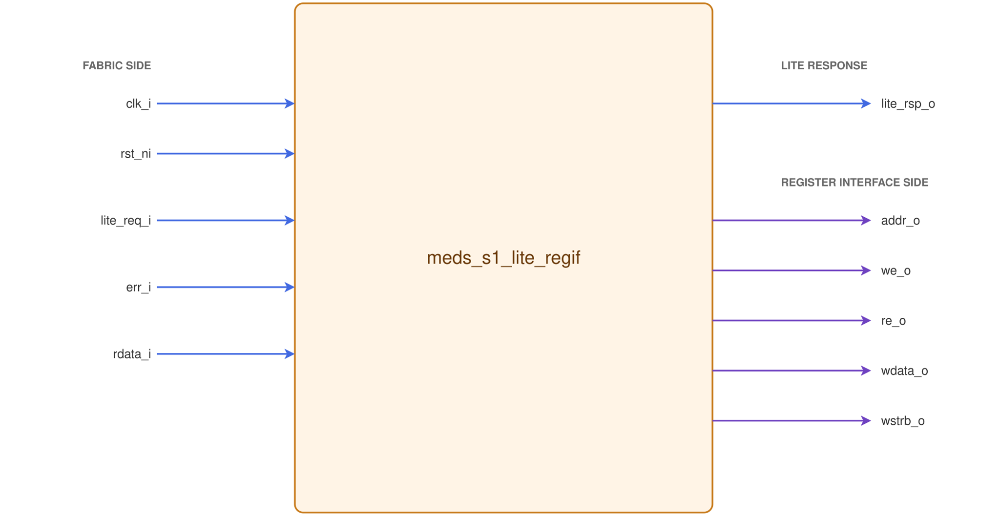

# `meds_s1_lite_regif`

| | |
|---|---|
| **Status** | COMPLETE — T-05 reference adapter |
| **Project** | T-05, consumed by M-01 · M-02 · M-03 · R-07 |
| **Spec** | `specs/INTERFACES.md` §3 (I4), SPEC §24, rule P3 |
| **Source** | `rtl/peripherals/meds_s1_lite_regif.sv` |
| **Testbench** | `verif/unit/tb_meds_s1_lite_regif.sv` |

## Purpose

Shared AXI4-Lite slave adapter for peripheral register files. It handles channel
handshakes, response buffering, and read/write arbitration so each peripheral
only implements combinational read decode and strobed writes.

With `REG_DW = 32`, the adapter selects one half of the 64-bit bus using the
address and presents 32-bit data and four byte strobes to the peripheral.
`REG_DW = 64` supports registers such as CLINT's `mtime` and `mtimecmp` in one access.

## Interface contract

Figure 19: AXI4-Lite request/response bundles and the peripheral register-file ports.

### Bus side — I4, frozen

| Signal | Dir | Width | Meaning | Contract |
|---|---|---|---|---|
| `clk_i` | in | 1 | clock | single domain |
| `rst_ni` | in | 1 | reset | async assert, sync de-assert |
| `lite_req_i` | in | `lite_req_t` | master-driven channels | `valid` stable with payload until `ready` |
| `lite_rsp_o` | out | `lite_rsp_t` | slave-driven channels | no `ready` depends on its own `valid`; no `valid` depends on a `ready` (R-C10) |

`AW` and `W` must be accepted **independently and in either order**. A slave that requires `AW`
first deadlocks against a master that presents `W` first, which AXI4-Lite permits.

### Register-file side — what a peripheral implements

The adapter uses the packed `lite_reg_req_t` and `lite_reg_rsp_t` types from
`meds_s1_lite_pkg`. Their fields use maximum bus widths; fields are meaningful
in the low `ADDR_W`, `REG_DW`, and `REG_DW/8` bits for the configured window.
Unused request bits are zero; unused response-data bits are ignored.

| Port field | Dir | Meaning | Contract |
|---|---|---|---|
| `reg_req_o.addr` | out | **byte** offset in the window | aligned down to `REG_DW/8`; decode against literal register-map offsets |
| `reg_req_o.we` | out | write strobe | one cycle; independent of `reg_rsp_i.err`; never high with `reg_req_o.re` |
| `reg_req_o.re` | out | read strobe | one cycle; needed for read-side-effect registers |
| `reg_req_o.wdata` | out | write data shifted out of its bus lane | low `REG_DW` bits |
| `reg_req_o.wstrb` | out | byte enables | low `REG_DW/8` bits; a peripheral must honour them |
| `reg_rsp_i.rdata` | in | read data | **combinational**, valid in the same cycle as `reg_req_o.re` |
| `reg_rsp_i.err` | in | "nothing is mapped at `addr`" | combinational from `reg_req_o.addr`; becomes `SLVERR` |

An unmapped write still asserts `reg_req_o.we`; the peripheral's address decode
prevents a mapped register update, while `reg_rsp_i.err` returns `SLVERR`. A
cross-lane write to a 32-bit register file suppresses `reg_req_o.we` and also
returns `SLVERR`.

**Backpressure:** responses are held until accepted, with the payload stable.
**Reset state:** all `valid` low, all `ready` low, no register access issued.
READY becomes available after the first rising clock edge following reset release.
A register cleared by reset controls this startup interval; `rst_ni` is used only
by sequential reset logic. Requests held valid during reset are captured only on
a later edge where READY and VALID are both high. Arbitration uses the reset-cleared
request flags, so no combinational reset gate is needed on register accesses.
**Latency:** without arbitration or a pending response, an `AW`/`W` pair executes
on the clock edge after the later of its two channel handshakes; an `AR` executes
on the clock edge after its handshake. `B`/`R` becomes valid immediately after
that execution edge. The register-file strobe and read-data sampling occur in
that execution cycle.

**Throughput:** the register-file side executes at most one access per clock. With an accepting
master, alternating reads and writes can sustain one access per clock after the holding registers fill.
A stream of only reads or only writes executes every other clock because its one-entry response holder
is occupied until the following response handshake. When both directions are eligible, a one-bit
round-robin grant chooses the direction opposite the prior grant; therefore neither direction can
starve while its response channel can make progress.

**Known read-width limitation:** AXI4-Lite read requests in `lite_req_t` carry neither byte strobes nor
an access-size field. For `REG_DW = 32`, this adapter returns the lane selected by the address but
cannot distinguish a legal 32-bit read from an unsupported 64-bit read at that address. The upstream
width/alignment check must reject the latter under rule P3; write requests are distinguishable because
their strobes are present and are rejected here when they span both lanes.

## Parameters

| Parameter | Default | Legal range | Effect |
|---|---|---|---|
| `ADDR_W` | 16 | 3 … `LITE_AW` | window size in address bits; 64 KiB → 16, 4 MiB → 22. Comes from the region's `size` in `configs/*.yaml` |
| `REG_DW` | 32 | 32 or 64 | register-file width. Must be `LITE_DW` or `LITE_DW/2`; fail at elaboration otherwise |

## Verification status

| Layer | Status | Where |
|---|---|---|
| Lint | Clean on `s1_nano`, `s1_base`, `s1_ai`, `s1_linux` | Verilator 5.020, `make lint CONFIG=<config>` |
| Unit test | `=== PASS : 5260 checks ===` | Verilator 5.020, 2026-10-10 |
| Mutation | All six deliberate faults detected | QuestaSim 2024.1, 2026-10-06; results below |

The same testbench also passes in QuestaSim 2024.1 with 5264 checks. Mutation
runs below use temporary copies in QuestaSim; deliberate faults are not committed.

The same test sequence runs at `REG_DW = 32` and `64`. It covers independent
AW/W acceptance, both arbitration priorities, byte strobes, aligned register
offsets, unmapped and cross-lane errors, stalled responses, and 250 seeded random
transactions per width. It also checks unused packed-struct bits stay zero.
Requests held valid across reset release verify that
no access occurs before their first READY/VALID handshake.

Mutation runs change one behavior at a time in temporary RTL copies. The
production RTL passes the same testbench; no deliberate fault is committed.

| Temporary change | Testbench result |
|---|---|
| Upper write lane selects lower-half data | `=== FAIL : 77 errors of 5264 checks ===` |
| Every read/write tie favors writes | `=== FAIL : 8 errors of 5264 checks ===` |
| Every read/write tie favors reads | `=== FAIL : 8 errors of 5264 checks ===` |
| Remove register-address alignment | `=== FAIL : 20 errors of 5264 checks ===` |
| W READY waits for AW VALID | `=== FAIL : 457 errors of 5248 checks ===` |
| AW READY waits for W VALID | `=== FAIL : 463 errors of 5248 checks ===` |

Generate-scope `$fatal(1, ...)` checks reject `REG_DW=16`, `ADDR_W=2`, and
`ADDR_W=41` during QuestaSim elaboration (exit code 12 for each).
